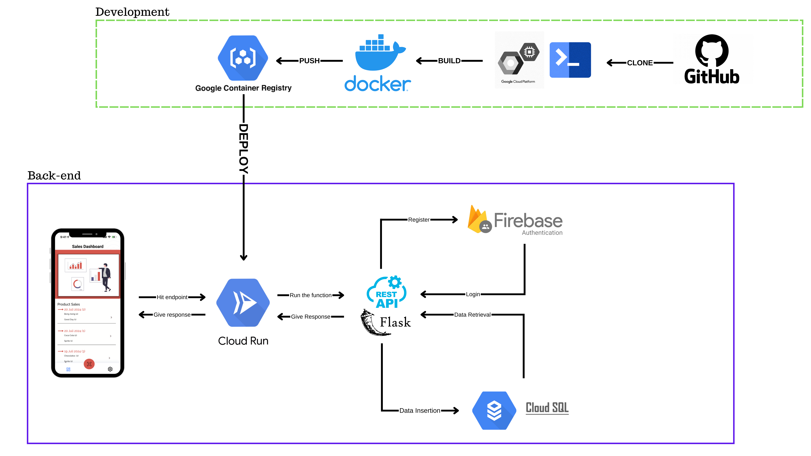

# 
 Smail-Capstone

# 
Cloud Computing Documentation

## 1. Clone Smail-Project Repository & Install the prequisite
 `git clone https://github.com/Qustomate/Capstone-Project-Qustomate.git`

  I recommend doing it in Google Cloud Shell

  Note : You can see the prequisite in [requirements.txt](https://github.com/Gudboi-UwU/Smail-Capstone/blob/5aadb7b3338a92b4c51fe5b7c742dfa7de8c0d09/Cloud_Computing/requirements.txt) file 

## 2. Setup the Database
  Create your database and create the tables in Google Cloud (MySQL)

  Note : You can see the table configuration in [database.txt](https://github.com/Gudboi-UwU/Smail-Capstone/blob/5180b41f0fb72862d20034dd10053eeaf3e51d39/database.txt) file `

## 3. Setup Firebase Authentication
  Setup the Firebase Authentication, and download the Service Account Key and put it in the Cloud_Computing Folder

## 4. Go to API folder and type python main.py in terminal
  Now you can try and use the API

## 5. Make the Image using Docker and push to Container Registry (Optional)
  Use docker build function in Google Cloud Shell using provided Dockerfile

  Note : Go inside Cloud_Computing folder first 

## 6. Deploy the Image to Cloud Run (Optional)
  Use the image in the Container Registry

  Note : Use 1 GiB for the memory or more

  Note : Setup the environment variables like in [env-variables.txt](https://github.com/Gudboi-UwU/Smail-Capstone/blob/e91fed66e71db2bf363a856c028135057fa3e42e/env-variables.txt) file 

## Cloud Computing : Smail Flow

## Cloud Computing : Smail Database Design

 

## Endpoints in our API

| Endpoints               | Explanation                                          | Request needed           |
| ----------------------  | ---------------------------------------------------- | ------------------------ |
| /                       | To test the API connection                           | -                        |
| /register               | To do registration process                           | email, password          |
| /login                  | To do the login process                              | email, password          |
| /detect                 | To detect the image input and send items id back     | image wih 'file' as key  |
| /barang                 | To get all items from database                       | -                        |
| /barang/id              | To get specific item from database based by id       | -                        |
| /tambah_penjualan       | To add transaction to database                       | tanggal, total_keseluruhan, daftar barang (id_barang, jumlah, total_barang) |
| /penjualan              | To get all the transaction from database             | -                        |
| /detail_penjualan/id    | To get detail of transaction based by id             | -                        |

 